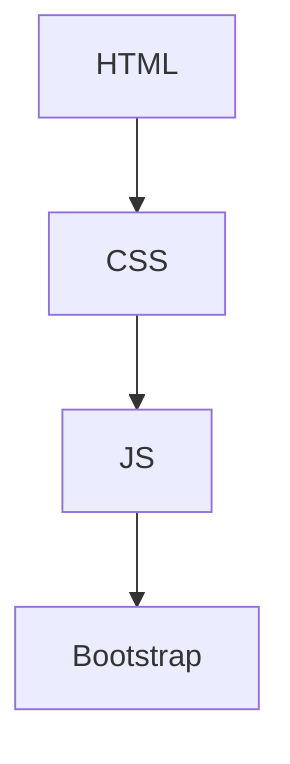
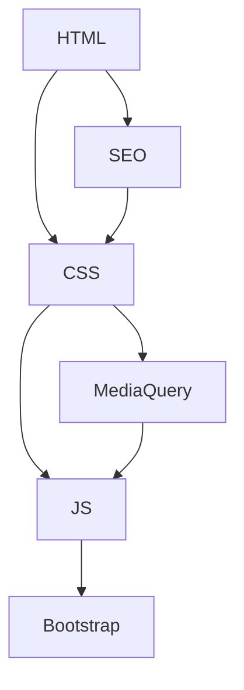
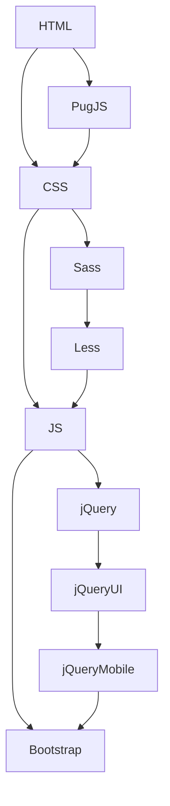
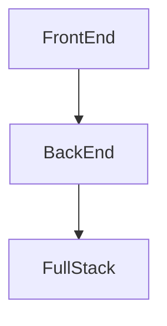

# Vahe - DFUT, GriArsVah, vahe-gri

## Dashboard

👋 Hi, I’m @GriArsVah :man: <br>
👀 I’m interested in music :musical_note:, movies :video_camera:, sport :runner:, game :video_game:, IT :computer: <br>
🌱 I’m currently learning JSFramework-Angular <br>
💞️ I’m looking to collaborate on with everyone <br>
📫 How to reach me griarsvah@gmail.com <br>
:iphone: +7-(981)-796-76-48

### Code
```JS
let x; // Объявляем переменную
x = 1; // Присваиваем переменной значение числавого типа
console.log(x); // Выводим значение переменной в консоли разработчика
```

### Quote
> Text that is a quote 1
> > Text that is a quote 2
> > > Text that is a quote 3
> > > > Text that is a quote 4
> > > > > Text that is a quote 5
> > > > > > Text that is a quote 6
> > > > > > > Text that is a quote 7
> > > > > > > > Text that is a quote 8
> > > > > > > > > Text that is a quote 9
> > > > > > > > > > Text that is a quote 10

<!---
GriArsVah/GriArsVah is a ✨ special ✨ repository because its `README.md` (this file) appears on your GitHub profile.
You can click the Preview link to take a look at your changes.--->

Here is a simple flow chart:










## Map
____
### geojson
```geojson
{
  "type": "FeatureCollection",
  "features": [
    {
      "type": "Feature",
      "id": 1,
      "properties": {
        "ID": 0
      },
      "geometry": {
        "type": "Polygon",
        "coordinates": [
          [
              [-50,35],
              [-50,30],
              [-85,30],
              [-85,35],
              [-50,35]
          ]
        ]
      }
    }
  ]
}
```
____
### topojson
```topojson
{
  "type": "Topology",
  "transform": {
    "scale": [0.0005000500050005, 0.00010001000100010001],
    "translate": [100, 0]
  },
  "objects": {
    "example": {
      "type": "GeometryCollection",
      "geometries": [
        {
          "type": "Point",
          "properties": {"prop0": "value0"},
          "coordinates": [4000, 5000]
        },
        {
          "type": "LineString",
          "properties": {"prop0": "value0", "prop1": 0},
          "arcs": [0]
        },
        {
          "type": "Polygon",
          "properties": {"prop0": "value0",
            "prop1": {"this": "that"}
          },
          "arcs": [[1]]
        }
      ]
    }
  },
  "arcs": [[[4000, 0], [1999, 9999], [2000, -9999], [2000, 9999]],[[0, 0], [0, 9999], [2000, 0], [0, -9999], [-2000, 0]]]
}
```

## 3D Model
```stl
solid cube_corner
  facet normal 0.0 -1.0 0.0
    outer loop
      vertex 0.0 0.0 0.0
      vertex 1.0 0.0 0.0
      vertex 0.0 0.0 1.0
    endloop
  endfacet
  facet normal 0.0 0.0 -1.0
    outer loop
      vertex 0.0 0.0 0.0
      vertex 0.0 1.0 0.0
      vertex 1.0 0.0 0.0
    endloop
  endfacet
  facet normal -1.0 0.0 0.0
    outer loop
      vertex 0.0 0.0 0.0
      vertex 0.0 0.0 1.0
      vertex 0.0 1.0 0.0
    endloop
  endfacet
  facet normal 0.577 0.577 0.577
    outer loop
      vertex 1.0 0.0 0.0
      vertex 0.0 1.0 0.0
      vertex 0.0 0.0 1.0
    endloop
  endfacet
endsolid
```

### 3D Model 2
```stl
  solid Octahedron_Created_by_Prototyre3D
    facet normal 0 0 0
      outer loop
        vertex 0 0 -1
        vertex 1 1 0
        vertex 1 -1 0
      endloop
    endfacet
    facet normal 0 0 0
      outer loop
        vertex 0 0 -1
        vertex 1 -1 0
        vertex -1 -1 0
      endloop
    endfacet
    facet normal 0 0 0
      outer loop
        vertex 0 0 -1
        vertex -1 -1 0
        vertex -1 1 0
      endloop
    endfacet
    facet normal 0 0 0
      outer loop
        vertex 0 0 -1
        vertex -1 1 0
        vertex 1 1 0
      endloop
    endfacet
    facet normal 0 0 0
      outer loop
        vertex 0 0 1
        vertex 1 -1 0
        vertex 1 1 0
      endloop
    endfacet
    facet normal 0 0 0
      outer loop
        vertex 0 0 1
        vertex -1 -1 0
        vertex 1 -1 0
      endloop
    endfacet
    facet normal 0 0 0
      outer loop
        vertex 0 0 1
        vertex -1 1 0
        vertex -1 -1 0
      endloop
    endfacet
    facet normal 0 0 0
      outer loop
        vertex 0 0 1
        vertex 1 1 0
        vertex -1 1 0
      endloop
    endfacet
endsolid Octahedron_Created_by_Prototyre3D
